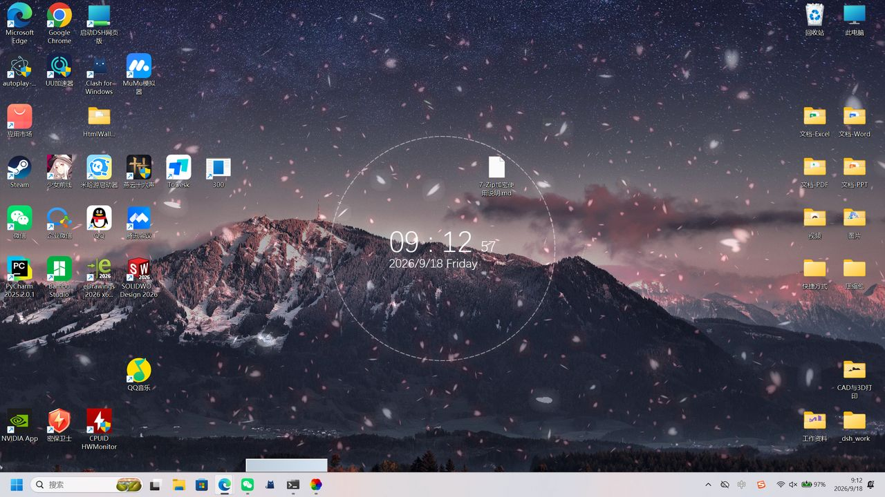

# 在 Lively Wallpaper 中运行这个壁纸

这个仓库是 **Wallpaper Engine 的 web 类型工程**(`project.json` 里 `"type": "web"`),不能直接当桌面
壁纸用。本页说明如何把它移植到开源引擎 **[Lively Wallpaper](https://github.com/rocksdanister/lively)**,
并且**不改动工程里的任何原始文件**。



## 1. 为什么直接加载会黑屏

实测:把 `index.html` 直接丢给 Lively,桌面会**全黑**。原因有三个,必须都处理:

| # | 原因 | 处理 |
| --- | --- | --- |
| 1 | 页面通过 `window.wallpaperPropertyListener.applyUserProperties()` 获取配置,这是 **Wallpaper Engine 专有 API**。没有它,页面停在"未配置"状态。 | 生成 `adapter.js`,把 `project.json` 里 `general.properties.*.value` 的 **132 项作者默认值**喂给页面 |
| 2 | `js/main.js` 在解析阶段有一段**反盗版校验**:XHR 取 `project.json` 核对 workshop id,不匹配就跳 `error.html`。本地加载时它会让页面卡死(WebView2 无响应、Lively 截图超时)。 | 生成 `js/main-lively.js`,把那一行替换为空操作 |
| 3 | 页面会自动播放媒体,而本仓库里的 `audio/*.ogg`、`video/*-test.webm` 是 **0 字节占位文件**(作者真正的媒体通过 Steam 创意工坊分发)。 | `index-lively.html` 里的 bootstrap 会移除这些 source,避免 404 |

## 2. 一条命令完成转换

```bash
python tools/convert-to-lively.py 884307090
```

转换后**只是新增文件,不修改任何原文件**:

```
884307090/
├─ LivelyInfo.json        # Lively 项目清单(标题、入口、缩略图)
├─ index-lively.html      # Lively 入口页(LivelyInfo.json 指向它)
├─ adapter.js             # 作者默认值适配层(原因 1)
├─ js/main-lively.js      # 去掉校验的 main.js 副本(原因 2)
└─ lively/                # 缩略图与预览图
```

想先看看会生成什么、不动原目录:

```bash
python tools/convert-to-lively.py 884307090 --output /tmp/lively-out
```

脚本是幂等的,可以反复运行。

## 3. 装进 Lively

1. 安装 [Lively Wallpaper](https://www.microsoft.com/store/productId/9NTM2QC6QWS7)
   (商店版或 [GitHub Release](https://github.com/rocksdanister/lively/releases) 均可)。
2. 打开 Lively → **Add Wallpaper** → 选择本仓库的 `884307090` **文件夹**
   (Lively 见到 `LivelyInfo.json` 就会按项目导入)。
3. 在库里双击"完美壁纸 884307090"即可生效。

命令行方式(商店版的 `Lively.exe` 通常在
`C:\Program Files\WindowsApps\12030rocksdanister.LivelyWallpaper_*\Build\Lively.exe`):

```powershell
& $livelyExe setwp --file "<仓库路径>\884307090"
```

## 4. 实测环境与结果

| 项目 | 结果 |
| --- | --- |
| 系统 | Windows 11 专业版 26200,150% 缩放,2560×1440 |
| Lively | v2.2.1.5(商店版) |
| 引擎接管桌面 | 日志 `Initializing WorkerW` → `Raised desktop with layered ShellView detected` → `Hooking WorkerW events` |
| 工程加载 | 日志 `Setting wallpaper: 完美壁纸 884307090` + `Wv20: Opening local project: ...index-lively.html` |
| 渲染窗口 | `Progman → WindowsForms '完美壁纸 (Lively)' → Chrome_WidgetWin_0`,rect `0,0,1707x960`,与图标宿主同尺寸同级 |
| 画面 | 背景、樱花粒子、音频可视化圆环、实时时钟/日期全部正常;桌面图标与任务栏不受影响 |
| 重启恢复 | 关闭并重启 Lively 后自动恢复该壁纸 |

## 5. 已知差异

- **没有声音**:如上所述,工程自带的音频文件是 0 字节占位文件。想加背景音乐,把真实音频文件
  放到 `audio/` 并去掉 `index-lively.html` 里的 bootstrap 即可。
- **天气默认关闭**(`project.json` 中 `weather_show` 为 `false`),与原工程默认一致。
- 页面内的时间/日期文字位置由作者写在 `js/time.js` 的默认布局里,与原工程表现一致。

## 6. 相关文件

| 路径 | 说明 |
| --- | --- |
| `tools/convert-to-lively.py` | 转换脚本(本页所有新增文件都由它生成) |
| `LIVELY.md` | 本文档 |
